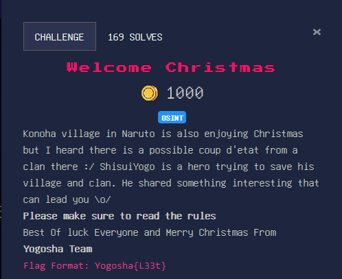
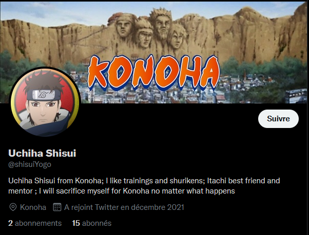
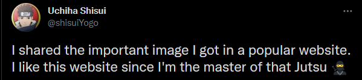
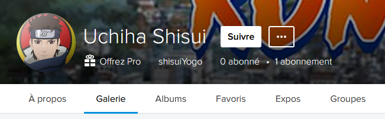
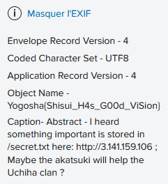

# Welcome Christmas

### Category

Osint

### Description

### Solution

So here we have a username "ShisuiYogo", first reflex, I search it on google to see if it has not been indexed somewhere (Twitter, Facebook, ...) and bingo, we find a Twitter account!

In addition, there is a tweet that is very interesting because it will allow us to continue to advance on this challenge:

With this twitter account, we recover a name and a surname "Uchiha Shisui".

Now it is necessary to think about the different sites allowing to host photos, there are :
- facebook
- instagram
- imgur
- flickr

Nothing was found on three of them, but on Flickr, if we search for "Uchiha Shisui", we found a profile with the same profil picture as the twitter account :

I know that on Flickr it is possible to get information about the image, including the metadata, if you look at them, you can observe:

### Flag

Yogosha{Shisui_H4s_G00d_ViSion} 