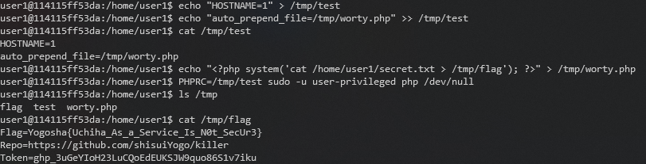

# Welcome Christmas

### Category

Web

### Description

### Solution

So there is a file called "secret.txt" in my home folder but it's own by root and only readable by "user-privileged".

Privesc time ! First reflex, use the command "sudo -l" to check if I have any permissions :

And I do! I have the rights to execute the command "php /dev/null" as user-privileged. 

My eyes are directly on the env_keep value, which means that when a command is called via sudo, the environment variables included in it (thus declared by user) will be transmitted to user-privileged without modification.

Here, the variable "PHPRC" interests me, indeed, I have already seen exploits which used it. A small blow on google "php privesc sudoers envkeep PHPRC" allows us to fall on this article which is very interesting: https://www.elttam.com/blog/env/.

We have an explanation of the vulnerability, an example with docker to show that it is exploitable, it remains only to put that in practice!

Let me explain this feat because having the solution is good but understanding it is better!

First, the PHPRC variable allows to contain the link to the PHP configuration script (php.ini), allowing to specify configurations for a web server (size of uploads files, location of session variables files, ...). You can quickly imagine that having control over this variable can be very bad (which is the case here).

In this configuration file, the instruction "auto_prepend_file", allows to specify a php file that will be loaded and executed when another script is executed.

So we have our exploit, we just create a file which contains an execution of a shell command, and as our PHPRC variable is in env_keep, and we have the rights to execute the php command as user-privileged, the system command will have the rights of the "user-privileged" user, which allows us to recover our precious flag !

### Flag

Yogosha{Uchiha_As_a_Service_Is_N0t_SecUr3}